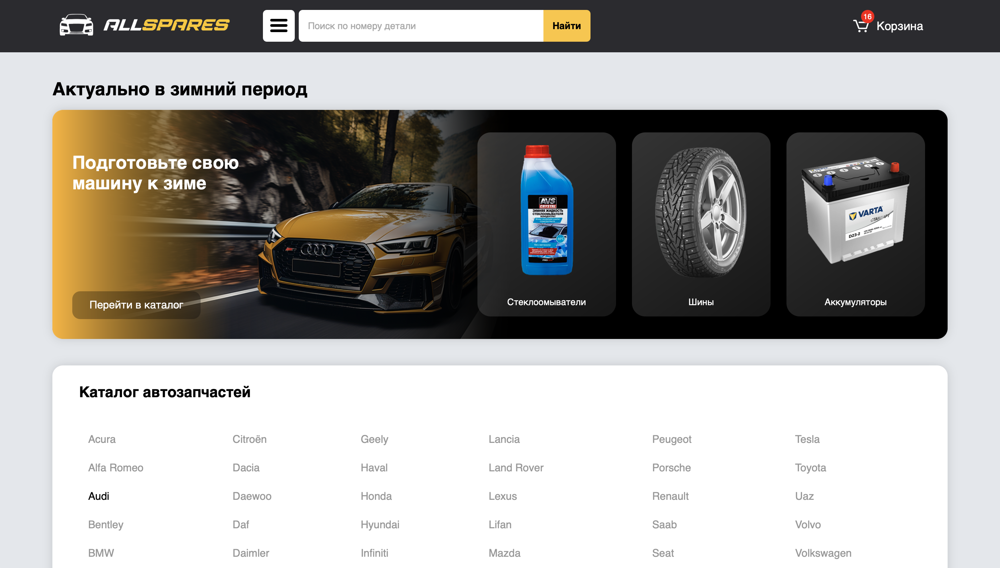
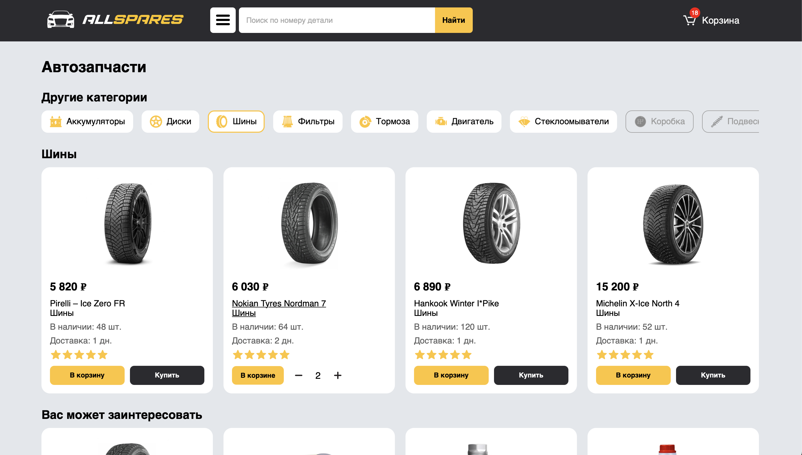
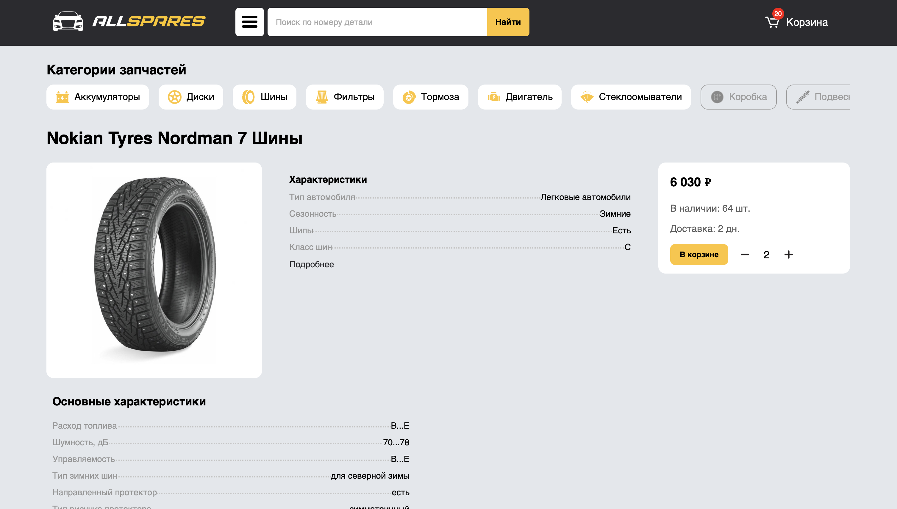
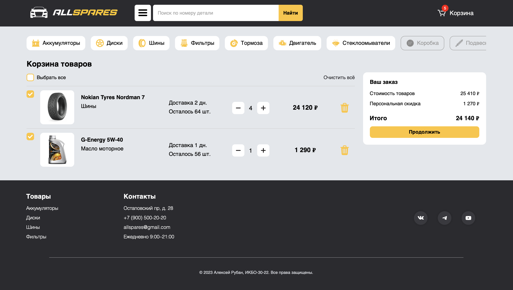

# AllSpares - Frontend

## О проекте
**AllSpares** — это веб-приложение для магазина автозапчастей. Проект предоставляет удобный интерфейс для поиска, выбора и покупки автозапчастей.

Сайт данного проекта доступен по ссылке: [https://aleksey-ruban.github.io/autoparts/](https://aleksey-ruban.github.io/autoparts/)

## Функциональность

### Главная страница
- Панель с актуальными предложениями.
- Панель выбора марки автомобиля.
- Список рекомендованных запчастей для пользователя.
- Поисковая строка для поиска запчастей по номеру или названию.

### Каталог запчастей
- Отображение запчастей для выбранной модели автомобиля.
- Фильтрация по категориям.
- Поиск запчастей по артикулу или номеру.

### Страница карточки товара
- Подробное описание запчасти.
- Характеристики товара.
- Кнопка добавления в корзину.

### Корзина
- Список добавленных товаров.
- Возможность редактирования количества товаров.
- Удаление товаров из корзины.

### Страница выбора автомобиля
- Выбор марки автомобиля.
- Выбор модели и поколения.
- Перенаправление в каталог запчастей для выбранной модели.

### Функционал каждой страницы
- Каждая страница имеет строку поиска запчастей по номеру или названию.
- Раскрывающееся меню для навигации по сайту.

## Технологии
- `HTML` - каркас страниц.
- `CSS` - декорация и анимация.
- `JavaScript` - интерактивное зваимодействие.

Весь интерактивный функционал, включающий функции корзины, поиска и фильтрации запчастей, реализован при помощи JavaScript.
